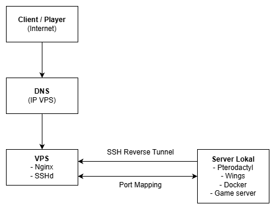

# Pterodactyl and Wings SSH Reverse Tunneling

> **Catatan:** Seluruh username, hostname, domain, alamat IP, dan token pada dokumentasi ini telah disamarkan. Nilai seperti `userlokal`, `vpsgateway`, `192.168.x.x`, `103.xxx.xxx.xxx`, dan `example.com` merupakan placeholder dan harus diganti dengan nilai sebenarnya saat konfigurasi.

## SSH Tunneling Architecture


## Konfigurasi Server Lokal
Mulai dengan menginstal `Pterodactyl Panel` dan `Wings` dengan script ini: 
```
bash <(curl -s https://pterodactyl-installer.se)
```

Lalu isi form yang diberikan scriptnya


## Konfigurasi Firewall
Mulai dengan menginstal `UFW` dan konfigurasi firewall yang akan di buka:
```
apt update -y
apt install ufw

ufw allow 22/tcp;
ufw allow 80/tcp; 
ufw allow 443/tcp; 
ufw allow 8081/tcp;
ufw allow 8082/tcp; 
ufw allow 2022/tcp; 
ufw allow 25565/tcp

ufw enable
```

## Membuat SystemMD untuk otomatisasi koneksi `SSH`
Mulai dengan membuat file `ssh-reverse-tunnel.service` di `/etc/systemd/system/` :
```
[Unit]
Description=SSH Reverse Tunnel Service
After=network.target

[Service]
User=root
ExecStart=/usr/bin/ssh -p 2299 -N \
  -o ExitOnForwardFailure=yes \
  -o ServerAliveInterval=60 \
  -o ServerAliveCountMax=3 \
  -R 8081:127.0.0.1:80 \
  -R 8082:127.0.0.1:443 \
  -R 2022:127.0.0.1:2022 \
  -R 25565:127.0.0.1:25565 \
  -R 25566:127.0.0.1:25566 \
  -R 25567:127.0.0.1:25567 \
  -R 2222:127.0.0.1:22 \
  vpsgateway@103.xxx.xxx.xxx
Restart=always
RestartSec=10
StandardOutput=journal
StandardError=journal

[Install]
WantedBy=multi-user.target
```

Setelah save filenya kita perlu reload service nya
```
systemctl daemon-reload
systemctl start ssh-reverse-tunnel.service
systemctl status ssh-reverse-tunnel.service
```

## Akses Panel Pterodactyl dan Membuat Node
Akses panel melalui IP lokal dari komputer server anda menggunakan username dan password yang telah di buat menggunakan script sebelumnya, lalu masuk ke admin dashboard untuk membuat `Node`. Saat proses pembuatan `Node` anda wajib mengisi `FQDN` dengan DNS bernama (contoh) `node1.example.com`. Lalu pada opsi `Behind Proxy` wajib memilih opsi bernama `"Behind Proxy"`. Dan terakhir ubah nilai angka `Daemon Port` ke port `443`. Setelah semua terkonfigurasi, klik `Create Node`. 


## Konfigurasi Wings
Setelah membuat `Node`. Anda perlu meng-konfigurasi `Wings` pada bagian `Configuration` di dalam `Node` yang telah anda buat tadi. Klik `Generate Token` pada bagian `Auto Deploy` lalu salin isi token yang telah di buat secara otomatis agar lebih mudah dalam konfigurasi `Wings` nya. Setelah di salin, masuk ke terminal linux dan paste isi token tadi lalu tekan Enter.
```
cd /etc/pterodactyl && sudo wings configure --panel-url http://192.168.x.x --token ptla_REDACTED_TOKEN --node 1
```

Setelah itu anda perlu mengubah konfigurasi secara manual di terminal dengan cara:
```
nano /etc/pterodactyl/config.yml
```

Ubah konfigurasinya:
```
debug: false
app_name: Pterodactyl
uuid: RAHASIA
token_id: RAHAISA
token: RAHAISA
api:
  host: 127.0.0.1                                                      #Ubah IP host
  port: 443
  ssl:
    enabled: false                                                     #Wajib false
    cert: /etc/letsencrypt/live/192.168.x.x/fullchain.pem
    key: /etc/letsencrypt/live/192.168.x.x/privkey.pem
  disable_remote_download: false
  upload_limit: 100
  trusted_proxies:                                                     #Tambahkan IP di trusted_proxies
  - 127.0.0.1
system:
  root_directory: /var/lib/pterodactyl
  log_directory: /var/log/pterodactyl
  data: /var/lib/pterodactyl/volumes
  archive_directory: /var/lib/pterodactyl/archives
  backup_directory: /var/lib/pterodactyl/backups
  tmp_directory: /tmp/pterodactyl
  username: pterodactyl
  timezone: Asia/Makassar                                             #Karena project Indonesia
  user:
    rootless:
      enabled: false
      container_uid: 0
      container_gid: 0
    uid: 998
    gid: 998
  disk_check_interval: 150
  activity_send_interval: 60
  activity_send_count: 100
  check_permissions_on_boot: true
  enable_log_rotate: true
  websocket_log_count: 150
  sftp:
    bind_address: 0.0.0.0
    bind_port: 2022
    read_only: false
  crash_detection:
    enabled: true
    detect_clean_exit_as_crash: true
    timeout: 60
  backups:
    write_limit: 0
    compression_level: best_speed
  transfers:
    download_limit: 0
  openat_mode: auto
docker:
  network:
    interface: 172.18.0.1
    dns:
    - 1.1.1.1
    - 1.0.0.1
    name: pterodactyl_nw
    ispn: false
    driver: bridge
    network_mode: pterodactyl_nw
    is_internal: false
    enable_icc: true
    network_mtu: 1500
    interfaces:
      v4:
        subnet: 172.18.0.0/16
        gateway: 172.18.0.1
      v6:
        subnet: fdba:17c8:6c94::/64
        gateway: fdba:17c8:6c94::1011
  domainname: ""
  registries: {}
  tmpfs_size: 100
  container_pid_limit: 512
  installer_limits:
    memory: 1024
    cpu: 100
  overhead:
    override: false
    default_multiplier: 1.05
    multipliers: {}
  use_performant_inspect: true
  userns_mode: ""
  log_config:
    type: local
    config:
      compress: "false"
      max-file: "1"
      max-size: 5m
      mode: non-blocking
throttles:
  enabled: true
  lines: 2000
  line_reset_interval: 100
remote: http://192.168.x.x                  #Tambahkan IP remote dengan IP lokal server
remote_query:
  timeout: 30
  boot_servers_per_page: 50
allowed_mounts: []
allowed_origins:                               #Tambahkan IP di allowed_origins
- http://192.168.x.x
- https://panel.example.com
allow_cors_private_network: false
ignore_panel_config_updates: false
```

Setelah itu save konfigurasi barunya, lalu anda perlu mengecek konfigurasi di terminal dengan mengetik:
```
wings
```

Jika semua berjalan normal anda bisa meng-aktifkan `Wings` nya:
```
systemctl start wings
systemctl status wings
```

Pada saat mengecek `node` pada panel dan ada icon hati berwarna merah `❤️`, itu masih normal karena kita belum mengkonfigurasi `nginx` di VPS.

## Konfigurasi `.env`
Setelah selesai konfigurasi `node` kita perlu menambahkan beberapa perintah pada .env `panel`nya:
```
APP_ENV=production
APP_DEBUG=false
APP_KEY=base64:RAHAISA
APP_THEME=pterodactyl
APP_TIMEZONE=Asia/Makassar
APP_URL="http://192.168.x.x"
APP_LOCALE=en
APP_ENVIRONMENT_ONLY=false
TRUSTED_PROXIES=127.0.0.1                #Tambahkan ini
```

Setelah di save, anda perlu clear cache nya:
```
php artisan config:cache
```

## Konfigurasi Server VPS
Setelah selesai konfigurasi pada server lokal, akan dilajutkan ke konfigurasi di VPS dimulai dengan menginstal `nginx`:
```
apt update -y
apt install nginx
```


## Konfigurasi Firewall di VPS
Mulai dengan menginstal `UFW` dan konfigurasi firewall yang akan di buka:
```
apt install ufw

ufw allow 22/tcp    # Untuk SSH
ufw allow 2299/tcp  # Untuk koneksi SSH Tunnel
ufw allow 80/tcp    # Untuk Certbot
ufw allow 443/tcp   # Untuk Panel & Wings (HTTPS)
ufw allow 2022/tcp  # Untuk SFTP
ufw allow 25565/tcp # Untuk Game
ufw allow 25566/tcp # Untuk Game
ufw allow 25567/tcp # Untuk Game
ufw allow 2222/tcp  # Untuk Admin SSH via tunnel

ufw enable
```

## Konfigurasi SSHD di VPS
Mengedit konfigurasi SSHD di `/etc/ssh/` dengan nama file `sshd_config`:
```
AllowTcpForwarding yes
GatewayPorts yes
```

Jika ada tanda `#` pada konfigurasinya, hapus tanda `#` nya. Setelah di simpan, anda harus me-restart layanan `SSHD` nya menggunakan perintah:
```
systemctl restart sshd
``` 


## Konfigurasi `Nginx` sebagai reverse proxy tunneling di VPS
Masuk ke direktori `/etc/nginx/sites-available/` lalu ubah konfigurasi `default`:
```
# Server block for the Pterodactyl Panel
server {
  listen 80;
  server_name panel.example.com;

  # SSL settings will be added by Certbot

  location / {
    # Proxy to the tunneled Panel port (8081)
    proxy_pass http://127.0.0.1:8081; 
    proxy_set_header X-Real-IP $remote_addr;
    proxy_set_header X-Forwarded-For $proxy_add_x_forwarded_for;
    proxy_set_header X-Forwarded-Proto $scheme;
    proxy_set_header Host $host;
    proxy_http_version 1.1;
    proxy_set_header Upgrade $http_upgrade;
    proxy_set_header Connection "upgrade";
    proxy_connect_timeout 600;
    proxy_send_timeout 600;
    proxy_read_timeout 600;
  }
}

# Server block for the Pterodactyl Wings (Node)
server {
  listen 80;
  server_name node1.example.com;
  client_max_body_size 1024M; # Batas upload file

  # SSL settings will be added by Certbot

  # Websocket location
  location ~ ^\/api\/servers\/(?<serverid>.*)?\/ws$ {
    # Proxy to the tunneled Wings port (8082)
    proxy_pass http://127.0.0.1:8082/api/servers/$serverid/ws;
    proxy_http_version 1.1;
    proxy_set_header Upgrade $http_upgrade;
    proxy_set_header Connection "upgrade";
    proxy_set_header Host $host;
    proxy_set_header X-Real-IP $remote_addr;
    proxy_set_header X-Forwarded-For $proxy_add_x_forwarded_for;
    proxy_set_header X-Forwarded-Proto $scheme;
    proxy_read_timeout 86400;
  }

  # General API location
  location / {
    # Proxy to the tunneled Wings port (8082)
    proxy_pass http://127.0.0.1:8082/;
    proxy_http_version 1.1;
    proxy_set_header Host $host;
    proxy_set_header X-Real-IP $remote_addr;
    proxy_set_header X-Forwarded-For $proxy_add_x_forwarded_for;
    proxy_set_header X-Forwarded-Proto $scheme;
  }
}
```

Setelah di save, tes konfigurasi `nginx` dan restart `nginx`
```
nginx -t
systemctl restart nginx
```

## Konfigurasi `Certbot` untuk sertifikasi `SSL/HTTPS` di VPS
Setelah `nginx` di jalankan dan berjalan normal, selanjutnya menambahkan sertifikasi `SSL` menggunakan `Certbot`:
```
apt install nginx python3-certbot-nginx -y
```

Setelah di-install, lanjut untuk mendapatkan sertifikat `SSL` nya:
```
certbot --nginx -d panel.example.com -d node1.example.com
```

Setelah perintah dijalankan, maka `Certbot` akan otomatis mengubah konfigurasi `default` `nginx` agar berjalan menggunakan `SSL`/`HTTPS`


# Maka selesai sudah konfigurasi Pterodactyl and Wings SSH Reverse Tunneling
Saat anda mengecek hati `node` yang sebelum nya berwarna merah `❤️` akan berubah menjadi warna hijau `💚` Sekian Terimakasih

<br>
<br>
<br>

# Migrasi VPS Tunnel Pterodactyl

Dokumen ini mencatat langkah-langkah untuk memindahkan gateway tunnel SSH dari VPS lama ke VPS baru dengan *downtime* minimal.

---

## Tahap 1: Siapkan Server VPS Baru

Tujuan dari tahap ini adalah membuat VPS baru siap menerima koneksi NGINX dan SSH Tunnel.

1.  **Instalasi Awal:**
    ```bash
    # Perbarui server dan instal NGINX + Certbot
    sudo apt update
    sudo apt install nginx python3-certbot-nginx -y
    ```
2.  **Konfigurasi Server SSH (`sshd_config`):**
    Edit file konfigurasi SSHD agar mengizinkan koneksi tunnel.
    ```bash
    sudo nano /etc/ssh/sshd_config
    ```
    Pastikan baris-baris berikut ada dan tidak memiliki tanda `#`:
    ```ini
    Port 22           # Port SSH admin Anda
    Port 2299         # Port untuk SSH Tunnel
    AllowTcpForwarding yes
    GatewayPorts yes
    ```
    Restart layanan SSH untuk menerapkan perubahan:
    ```bash
    sudo systemctl restart sshd
    ```
3.  **Konfigurasi Firewall (UFW) di VPS Baru:**
    Buka semua port publik yang diperlukan.
    ```bash
    sudo apt install ufw

    # Port Admin & Tunnel
    sudo ufw allow 22/tcp
    sudo ufw allow 2299/tcp

    # Port Web (NGINX & SSL)
    sudo ufw allow 80/tcp
    sudo ufw allow 443/tcp

    # Port Pterodactyl & Game (sesuai file .service Anda)
    sudo ufw allow 2022/tcp
    sudo ufw allow 2222/tcp
    sudo ufw allow 7777/tcp
    sudo ufw allow 8123/tcp
    sudo ufw allow 25565/tcp
    sudo ufw allow 25566/tcp
    sudo ufw allow 25567/tcp
    sudo ufw allow 25568/tcp
    
    sudo ufw enable
    ```

---

## Tahap 2: Arahkan Ulang DNS

Ini adalah langkah krusial. Anda harus mengarahkan domain Anda ke IP VPS baru **sebelum** menjalankan Certbot.

1.  Buka dashboard penyedia DNS Anda.
2.  Ubah **'A Record'** untuk domain berikut agar mengarah ke **IP VPS BARU** Anda:
    * `panel.example.com`
    * `node1.example.com`
    * (Dan domain game lainnya seperti `play` jika ada)
3.  Tunggu propagasi DNS. Anda bisa memeriksanya di `whatsmydns.net` sampai IP-nya ter-update.

---

## Tahap 3: Konfigurasi NGINX & SSL (di VPS Baru)

Setelah DNS ter-update, kita siapkan NGINX dan dapatkan sertifikat SSL baru.

1.  **Buat File Konfigurasi NGINX:**
    Buat file konfigurasi baru (kita gunakan `pterodactyl.conf` agar lebih rapi).
    ```bash
    sudo nano /etc/nginx/sites-available/pterodactyl.conf
    ```
    Tempel (paste) konfigurasi **port 80** di bawah ini:
    ```nginx
        # Server block untuk Pterodactyl Panel
        server {
          listen 80;
          server_name panel.example.com;

          location / {
            # Proxy ke port tunnel Panel (8081)
            proxy_pass http://127.0.0.1:8081;
            proxy_set_header Host $host;
            proxy_set_header X-Real-IP $remote_addr;
            proxy_set_header X-Forwarded-For $proxy_add_x_forwarded_for;
            proxy_set_header X-Forwarded-Proto $scheme;
            proxy_http_version 1.1;
            proxy_set_header Upgrade $http_upgrade;
            proxy_set_header Connection "upgrade";
          }
        }

        # Server block untuk Pterodactyl Wings (Node)
        server {
          listen 80;
          server_name node1.example.com;
          client_max_body_size 1024M; # Batas upload file

          # Lokasi Websocket
          location ~ ^\/api\/servers\/(?<serverid>.*)?\/ws$ {
            # Proxy ke port tunnel Wings (8082)
            proxy_pass http://127.0.0.1:8082/api/servers/$serverid/ws;
            proxy_http_version 1.1;
            proxy_set_header Upgrade $http_upgrade;
            proxy_set_header Connection "upgrade";
            proxy_set_header Host $host;
          }

          # Lokasi API Umum
          location / {
            # Proxy ke port tunnel Wings (8082)
            proxy_pass http://127.0.0.1:8082/;
            proxy_http_version 1.1;
            proxy_set_header Host $host;
          }
        }
    ```
2.  **Aktifkan Konfigurasi:**
    Hapus link `default` (jika ada) dan aktifkan yang baru.
    ```bash
    # Hapus file default agar tidak konflik
    sudo rm /etc/nginx/sites-enabled/default
    
    # Buat link simbolis untuk file baru
    sudo ln -s /etc/nginx/sites-available/pterodactyl.conf /etc/nginx/sites-enabled/
    ```
    *(Jika Anda mendapat error `File exists`, itu tidak masalah, berarti Anda sudah membuatnya.)*

3.  **Tes dan Restart NGINX:**
    ```bash
    sudo nginx -t
    sudo systemctl restart nginx
    ```

4.  **Jalankan Certbot:**
    Perintah ini akan mendapatkan SSL dan secara otomatis mengedit file `pterodactyl.conf` Anda untuk beralih ke HTTPS.
    ```bash
    sudo certbot --nginx -d panel.example.com -d node1.example.com
    ```
    Pilih opsi **Redirect** (biasanya Pilihan 2) saat ditanya.

---

## Tahap 4: Arahkan Ulang Tunnel (di Server LOKAL)

Ini adalah langkah terakhir: memberitahu server lokal (`server-lokal`) untuk "menelpon" IP VPS baru.

1.  **Hentikan Layanan Tunnel (di Server Lokal):**
    ```bash
    sudo systemctl stop ssh-reverse-tunnel.service
    ```
2.  **Edit File Layanan:**
    ```bash
    sudo nano /etc/systemd/system/ssh-reverse-tunnel.service
    ```
    Temukan baris `ExecStart` dan **hanya ubah alamat IP-nya**.
    *Ganti dari:*
    `... vpsgateway@103.xxx.xxx.xxx`
    *Menjadi (contoh):*
    `... vpsgateway@103.xxx.xxx.xxx`

3.  **Muat Ulang Konfigurasi:**
    ```bash
    sudo systemctl daemon-reload
    ```
    *(Layanan **jangan** di-start dulu.)*

---

## Tahap 5: Atasi Error "Host key verification failed"

Saat pertama kali terhubung, server lokal Anda akan menolak VPS baru karena "sidik jari" (host key) SSH-nya berbeda. Kita harus memperbaikinya secara manual.

1.  **Hapus Key Lama (di Server Lokal):**
    Jalankan perintah ini untuk menghapus key VPS lama dari `known_hosts` milik `root`.
    ```bash
    # Ganti dengan IP VPS BARU Anda
    ssh-keygen -R "103.xxx.xxx.xxx"
    ```
    *(Jika gagal, coba juga `ssh-keygen -R "[103.xxx.xxx.xxx]:2299"`)*

2.  **Terima Key Baru (Wajib):**
    Jalankan koneksi SSH **secara manual satu kali** sebagai `root` (karena layanan Anda berjalan sebagai `root`) untuk menerima key baru.
    ```bash
    # Gunakan user, port, dan IP yang sama persis dengan file .service Anda
    sudo ssh -p 2299 vpsgateway@103.xxx.xxx.xxx
    ```
    SSH akan bertanya: `Are you sure you want to continue connecting (yes/no/[fingerprint])?`
    Ketik `yes` dan tekan **Enter**.
    
    Setelah Anda berhasil login ke VPS baru, Anda bisa langsung mengetik `exit` untuk kembali.

3.  **Mulai Layanan Tunnel (di Server Lokal):**
    Sekarang setelah key baru disimpan, layanan tunnel dapat dimulai.
    ```bash
    sudo systemctl start ssh-reverse-tunnel.service
    ```

4.  **Verifikasi:**
    ```bash
    sudo systemctl status ssh-reverse-tunnel.service
    ```
    Seharusnya layanan menampilkan `active (running)` dan tidak ada lagi error `Host key verification failed` di log (`journalctl`). Panel Anda sekarang akan online kembali.
